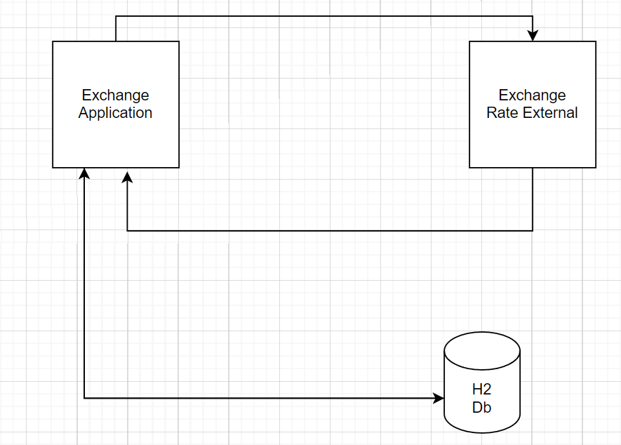

# Currency App

## Özet
Uygulamada 3 endpoint bulunmaktadır.

1.  "exchange-rate"

GET endpointidir. Verilen döviz cinsler arasındaki kuru dönen servistir.

    * Input
        1. source: Dönüştürülecek Döviz Kodu
        2. target: Dönüşecek Döviz Kodu

    *Output
        1. base: source ile aynı
        2. symbol: target ile aynı
        3. rate: source'un target cinsinden fiyatlaması

2.  "conversion"

Post endpointidir. Verilen döviz cinsler arasında ve verilen miktarda döviz dönüşümü yapan servistir.

    * Input
        1. sourceCurrency: Dönüştürülecek Döviz Kodu
        2. targetCurrency: Dönüşecek Döviz Kodu
        3. sourceAmount: Dönüştürülecek Döviz Miktarı

    *Output
        1. targetAmount: Döviz Dönüşümü sonrası verilmesi gereken Tutar
        2. transactionId: uygulamanın döviz dönüşümünü kaydederken oluşan bir unique değerdir.

3.  "conversion-list"

Get endpointidir. Yapılan döviz işlemlerinin sorgulanabildiği endpointtir. Endpointte Pagination mevcuttur.Uygulamada pagination olduğundan id ile sorting yapılmaktadır.

    * Input
        1. transactionDate: Girilen tarihteki Döviz işlemlerini temsil eder. "yyyy-MM-dd" formatındadır.
        2. transactionId: Döviz işlemi sırasında oluşan unique değeri temsil eder
    
    * URL Inputları
        1.pageNumber: sayfa numarası
        2.pageSize: sayfada gösterilebilecek obje sayısı
        Burada bu değerler kullanıcının isteği durumda kullanıcı tarafından belirlenebilmektedir. Kullanıcının bu değerleri girmemesi durumunda pageNumber default 0 pageSize default 10 olarak tanımlanmıştır. 

    *Output
        1. conversionList: Tutar ve TransactionId'nin olduğu obje liste olarak döner.
        2. pageNumber: Kaçıncı sayfada olduğunu belirtir.
        3. pageSize: Sayfada gösterilebilecek obje sayısı. 
        4. totalSize: Toplamda ne kadar obje olduğunu belirtir.

Uygulama döviz kurlarını http://api.exchangeratesapi.io üzerinden almaktadır. Bu uygulamada oluşturulan hesap trial hesap olduğundan sadece Euro cinsinden döviz dönüşümü yapmaktadır. 
Uygulama veritabanı olarak H2 Db kullanmaktadır.

Uygulamanın basit mimarisi aşağıdaki gibidir.

